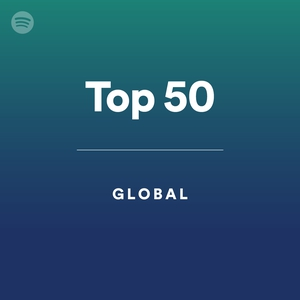
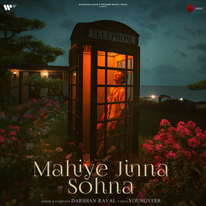

# Spotify Clone

A frontend clone for a very reknowned music app used word wide.
Spotify clone is made using HTML and CSS.

# HTML CODE :
<!DOCTYPE html>
<html lang="en">
<head>
    <meta charset="UTF-8">
    <meta name="viewport" content="width=device-width, initial-scale=1.0">
    <title>Spotify - Web Player: Music for everyone</title>
    <link rel="stylesheet" href="index.css">
    <link rel="stylesheet" href="https://cdnjs.cloudflare.com/ajax/libs/font-awesome/7.0.0/css/all.min.css" integrity="sha512-DxV+EoADOkOygM4IR9yXP8Sb2qwgidEmeqAEmDKIOfPRQZOWbXCzLC6vjbZyy0vPisbH2SyW27+ddLVCN+OMzQ==" crossorigin="anonymous" referrerpolicy="no-referrer" />
    <link rel="icon" href="./assets/logo.png">
    <link rel="preconnect" href="https://fonts.googleapis.com">
    <link rel="preconnect" href="https://fonts.gstatic.com" crossorigin>
    <link href="https://fonts.googleapis.com/css2?family=Montserrat:ital,wght@0,100..900;1,100..900&display=swap" rel="stylesheet">
</head>
<body>
    

        

            

                

                    <i class="fa-solid fa-house"></i>
                    <a href="#">Home</a>
                

                

                    <i class="fa-solid fa-magnifying-glass"></i>
                    <a href="#">Search</a>
                

            

            

                

                    

                        
                        <a href="#">Your Library</a>
                    

                    

                        <i class="fa-solid fa-plus"></i>
                        <i class="fa-solid fa-arrow-right"></i>
                    

                

                

                    

                        
Create your first playlist

                        
It's easy, we'll help you

                        <button class="badge">Create playlist</button>
                    

                    

                        
Let's find some podcasts to follow

                        
We'll keep you updated on new episodes

                        <button class="badge">Browse podcasts</button>
                    

                

            

        

        

            

                

                    
                    
                

                

                    <button class="badge nav-item hide">Explore Premium</button>
                    <button class="badge nav-item dark-badge"><i class="fa-solid fa-circle-down" style="margin-right: 5px;"></i>Install App</button>
                    <i class="fa-solid fa-user nav-item"></i>
                

            

            <h2>Recently Played</h2>
            

                

                    
                    
Top 50 - Global

                    
Your daily updates of the most played...

                

            

            <h2>Trending now near you</h2>
            

                

                    
                    
Top 50 - Global

                    
Your daily updates of the most played...

                

                

                    
                    
Top 50 - Global

                    
Your daily updates of the most played...

                

                

                    
                    
Top 50 - Global

                    
Your daily updates of the most played...

                

                

                    
                    
Top 50 - Global

                    
Your daily updates of the most played...

                

                

                    
                    
Top 50 - Global

                    
Your daily updates of the most played...

                

            

             <h2>Featured Charts</h2>
            

                

                    
                    
Top 50 - Global

                    
Your daily updates of the most played...

                

                

                    
                    
Top Songs - India

                    
Your daily updates of the most played...

                

                

                    
                    
Top 50 - Global

                    
Your daily updates of the most played...

                

            

            
            

                

            

        

        

            

                

                

                    
Daylight

                    
David Kushneer

                

                

                    
                    
                

                
            

            

                

                    
                    
                    
                    
                    
                

                

                    00:00
                    <input type="range" min="0" max="100" step="1" class="progress-bar">
                    3:33
                

            

            

                

                    
                    
                    
                    
                    
                    <input type="range" min="0" max="100" step="1" class="control-bar">
                

            

        

    

</body>
</html>

# CSS Code:

body{
    font-family: 'Montserrat',  sans-serif;
    margin: 0;
    background-color: black;
    color: white;
    overflow: scroll;
}

.main{
    display: flex;
    height: 100vh;
    padding: 0.5rem;
}

.sidebar{
    background-color: #000;
    width: 340px;
    border-radius: 1rem; /*1rem=16px*/
    margin-right: 0.5rem;
}

.maincontent{
    background-color: #121212;
    color: black;
    flex: 1;
    border-radius: 1rem;
    padding-bottom: 72px; 
    padding: 0 1.5rem 0 1.5rem;
}

.music-Player{
    background-color:#000;
    color :black;
    bottom: 0;
    position: fixed;
    width: 100%;
    height: 72px;
}

a{
    text-decoration: none;
    color: white;
    margin: 1rem;
}

.nav{
    background-color: #121212;
    border-radius: 1rem;
    display: flex;
    flex-direction: column;
    justify-content: center;
    height: 100px;
    padding: 0.5rem 0.75rem;

}

.nav-option{
    line-height: 2.5rem;
    opacity: 0.7;
    padding: 0.5rem 0.75rem;
    font-size: 1.25rem;
}

.nav-option:hover{
    opacity: 1;
}

.nav-option a{
    font-size: 1rem;
    margin-left: 1rem;
}

.library{
    background: #121212;
    border-radius: 1rem;
    height: 100%;
    margin-top: 0.5rem;
    padding: 0.5rem 0.75rem;
}

.options{
    display: flex;
    justify-content: space-between;
    align-items: center ;
}

.lib-option img{
    height: 1.25rem;
    width: 1.25rem;
}

.icons{
    font-size: 1.2rem;
    display: flex;
}

.icons i{
    opacity: 0.7;
    margin-right: 1rem;
}

.icons i:hover{
    opacity: 1;
}

.box{
    background-color: #232323;
    height: 8rem;
    border-radius: 0.75rem;
    margin: 0.75rem 0 1.75rem 0;
    padding: 0.75rem 1rem;
}

.box-p1{
    font-size: 1rem;
    font-weight: 500;
}
.box-p2{
    font-size: 0.75rem;
    opacity:0.9;
}

.badge{
    background-color: #fff;
    border: none;
    border-radius: 100px;
    padding: 0.25rem 1rem ;
    font-weight: 700;
    margin-top: 0.5rem;
    height: 2rem;
    width: fit-content;
}
.dark-badge{
    background-color: #000;
    color: #fff;
}

.sticky-nav{
    position: sticky;
    top: 0;
    background-color: #121212;
    display: flex;
    justify-content: space-between;
    align-items: center;
    padding: 1rem 0 1rem 0;
    z-index: 10;
}

.sticky-nav-icons i{
    margin-left: 0.75rem;
}

.sticky-nav-options{
    display: flex;
    justify-content: center;
    align-items: center;
}

.nav-item{
    margin-right: 1rem;
}

@media(max-width:1000px){
    .hide{
        display: none;
    }
}

.maincontent h2{
    color: #fff;
}

.cards{
    color: #fff;
}
.card{
    background-color: #232323;
    color: #fff;
    border-radius: 0.5rem;
    width: 150px;
    padding: 1rem;
    margin-left: 1.5rem;
    margin-top: 1rem;
}

.cards-container{
    display: flex;
    flex-wrap: wrap;
}

.card-img{
    width: 100% ;
    border-radius: 0.5rem;
}

card-title{
    font-weight: 600;
}

.card-info{
    font-size:0.85rem;
    opacity: 0.8;
}

.footer{
    height: 300px;
    display: flex;
    align-items: center;
    justify-items: center;
}

.line{
    width: 90%;
    height: 50%;
    border-top: 1px solid white;
    opacity: 0.4;
}

.music-Player{
    display: flex;
    justify-content: center;
    align-items: center;
}

.album{
    width: 25%;
}

.player{
    width: 50%;
}

.controls{
    width: 25%;
}

.player-controls{
    display: flex;
    justify-content: center;
    align-items: center;
}

.player-controls-icons{
    width: 1rem;
    margin-right: 1.75rem;
    opacity: 0.7;
}

.player-controls-icons:hover{
    opacity: 1;
}

.playback-bar{
    display: flex;
    justify-content: center;
    align-items: center;
    color: #fff;
}

.progress-bar{
    width: 70%;
    appearance: none;
    background-color: transparent;
    cursor: pointer;
}

.progress-bar::-webkit-slider-runnable-track{
    background-color: #ddd;
    border-radius: 100px;
    height: 0.2rem;
}

.progress-bar::-webkit-slider-thumb{
    appearance: none;
    height: 1rem;
    width: 1rem;
    background-color: #1bd760;
    border-radius: 50%;
    margin-top: -6px;
}

.album{
    display: flex;
    text-align: center;
    justify-content: center;
    margin-top: 50px;
    margin-right: 250px;
}

.alb1{
    height: 10px;
    width: 10px;
}

.alb-para{
    display:flex;
    flex-direction: column;
    justify-content: center;
    align-items: baseline;
    font-size: 0.75rem;
    line-height: 0.1rem;
    color: #fff;
    margin-left: 65px;
    margin-bottom: 60px;
}

.alb-para1{
    font-weight: 500;
}

.alb-para2{
    opacity: 0.7;
}

.alb2{
    display: flex;
    justify-items: center;
    height: 25px;
    width: 25px;
    margin-top: 15px;
    margin-left: 30px;
    opacity: 0.8;

}

.alb-icon1{
    margin-right: 10px;
}

.controls {
    display: flex;
    justify-content: center;
    align-items: center;
}

.con-icons {
    display: flex;
    align-items: center;
    gap: 1rem; /* equal spacing between icons & slider */
}

.con1 {
    height: 1.2rem;
    width: 1.2rem;
    opacity: 0.8;
    cursor: pointer;
    transition: opacity 0.3s;
}

.con1:hover {
    opacity: 1;
}

.control-bar {
    width: 120px;  /* adjust width as per design */
    appearance: none;
    background: transparent;
    cursor: pointer;
}

/* Track */
.control-bar::-webkit-slider-runnable-track {
    background:#fff; /* white bar */
    border-radius: 100px;
    height: 0.3rem;
}

/* Thumb */
.control-bar::-webkit-slider-thumb {
    appearance: none;
    height: 0.8rem;
    width: 0.8rem;
    background: #fff;
    border-radius: 50%;
    box-shadow: 0 0 2px rgba(0,0,0,0.5);
    margin-top: -0.25rem; /* centers thumb on track */
}
